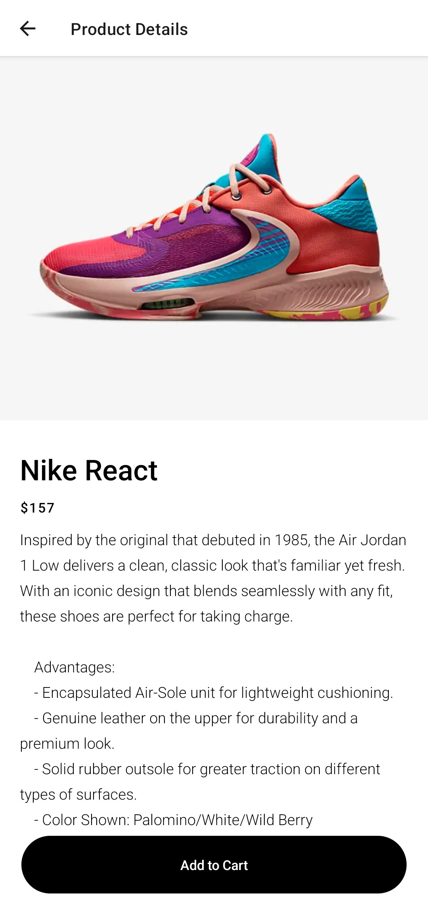

# NikeApp

This is a repository for Nike app that show popular shoes and user can add multiple shoes to cart. Made with React Native, JavaScript, Redux Toolkit, Expo.

Funcionalities:

- In app navigation.
- Global state management with Redux.
- Add/remove shoes to/from cart.
- Increase/Decrease quantity in cart.

### Prerequisites

**Node ^= 16**

**Android Studio / XCode / Expo Go App (Virtual Device Simulation)**

**VS Code (IDE)**

### Cloning the repository

```shell
git clone https://github.com/nayak-nirmalya/NikeApp.git
```

## Running Project

Clone this Repository. Navigate to root directory and run the following npm command:

```shell
cd NikeApp
npm run start
```

## Screenshots

<div align='center'>

### Home Screen


### Product Details Screen / Modal



### Cart Page


</div>
